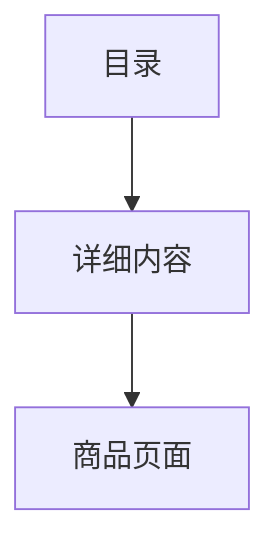

## 项目结构

─com
    └─polly
        └─jiuWu
            ├─category
            └─user
                ├─dao //底层，抽象接口以及实现类
                ├─domain//域模型层
                ├─service//业务层
                └─web//web层
                    └─servlet

## 数据库

本项目数据库使用的是MySQL数据库，使用c3p0连接池，防止对数据库的反复请求，浪费资源。

### 表

| Tables_in_jiuwu |
| --------------- |
| t_admin         |
| t_cartitem      |
| t_category      |
| t_goods         |
| t_order         |
| t_orderitem     |
| t_user          |

### 表结构（//描述表之间的联系，文字叙述表的内容）

#### t_admin:用户后台管理员登陆

| Field                  | Type        | Null | Key  | Default | Extra |
| ---------------------- | ----------- | ---- | ---- | ------- | ----- |
| adminId                | Char(32)    | No   | Pril | null    |       |
| Adminname（管理员名）  | Varchar(50) | Yes  |      | null    |       |
| adminpwd（管理员密码） | Varchar(50) | yes  |      | null    |       |

 

#### t_user:用户表

| Field                                  | Type        | Null | Key  | Default | Extra |
| -------------------------------------- | ----------- | ---- | ---- | ------- | ----- |
| Uid                                    | Char(32)    | No   | Pri  | Null    |       |
| Loginname（用户名）                    | Varchar(50) | yes  | Uni  | Null    |       |
| Loginpass（用户密码）                  | Varchar(50) | yes  |      | null    |       |
| email（邮箱）                          | Varchar(50) | yes  |      | Null    |       |
| status（验证状态）                     | Tinyint(1)  | yes  |      | null    |       |
| activationCode（激活码，用于确认邮箱） | Char(64)    | yes  |      | null    |       |

 

#### t_order:订单表

| Field                   | Type          | Null | Key                                       | Default | Extra |
| ----------------------- | ------------- | ---- | ----------------------------------------- | ------- | ----- |
| Oid                     | Char(32)      | No   | Pri                                       | Null    |       |
| Ordertime（下订单时间） | Char(19)      | Yes  |                                           | Null    |       |
| Total（总计）           | Decimal(10,2) | YES  |                                           | NULL    |       |
| Status（状态）          | Int(11)       | Yes  |                                           | null    |       |
| Address（地址）         | Varchar(1000) | Yes  |                                           | Null    |       |
| Uid（用户id）           | Char(32)      | Yes  | Mul（用户与订单之间的关系为一对多的关系） | Null    |       |

 

#### t_category:（所有）商品目录

| Field            | Type         | Null | Key  | Default | Extra          |
| ---------------- | ------------ | ---- | ---- | ------- | -------------- |
| Cid              | Char(32)     | No   | Pri  | Null    |                |
| Cname（类名）    | Varchar(50)  | Yes  | Uni  | Null    |                |
| Pid//对应cid的名 | Char(32)     | Yes  | Mul  | Null    |                |
| Desc（描述）     | Varchar(100) | Yes  |      | Null    |                |
| orderBy          | Int(11)      | No   | Mul  | Null    | Auto_increment |

 cid->一级目录;pid->二级目录。pid指向cid

#### t_goods:（所有）商品

| Field                                                        | Type         | Null | Key  | Default | Extra          |
| ------------------------------------------------------------ | ------------ | ---- | ---- | ------- | -------------- |
| Gid                                                          | Char(32)     | No   | Pri  | Null    |                |
| Gname（商品名）                                              | Varchar(200) | Yes  |      | Null    |                |
| Author（作者，针对图书类）                                   | Varchar(50)  | yes  |      | Null    |                |
| price（价格）                                                | Decimal(8,2) | yes  |      | Null    |                |
| currPrice（现价）                                            | Decimal(8,2) | Yes  |      | Null    |                |
| discount（折扣）                                             | Decimal(3,1) | yes  |      | Null    |                |
| press（原价）                                                | Varchar(100) | yes  |      | Null    |                |
| publishtime（出版时间，针对图书类）                          | Char(10)     | Yes  |      | Null    |                |
| edition（版本，针对图书类、电子产品类）                      | Int(11)      | yes  |      | Null    |                |
| pageNum（页数，针对图书类）                                  | Int(11)      | yes  |      | Null    |                |
| wordNum（总字数，针对图书类）                                | Int(11)      | Yes  |      | Null    |                |
| printtime（装订时间，针对图书）                              | Char(10)     | yes  |      | Null    |                |
| booksize（大小，针对图书类：例如：16开、电子产品类：例如：ipad为16G） | Int(11)      | yes  |      | Null    |                |
| paper（纸张）                                                | Varchar(50)  | Yes  |      | Null    |                |
| cid（目录名）                                                | Char(32)     | yes  |      | Null    |                |
| Image_w（图片）                                              | Varchar(100) | yes  |      | Null    |                |
| Image_b（图片）                                              | Varchar(100) | Yes  |      | Null    |                |
| orderBy                                                      | Int(11)      | no   |      | Null    | Auto_increment |

 

#### t_cartItem:购物车商品

| Field            | Type     | Null | Key                                           | Default | Extra          |
| ---------------- | -------- | ---- | --------------------------------------------- | ------- | -------------- |
| cartItemId       | Char(32) | No   | Pri                                           | Null    |                |
| Quantity（数目） | Int(11)  | Yes  |                                               | Null    |                |
| Gid（商品id）    | Char(32) | Yes  | Mul（一个购物车id与商品之间的关系是一对多）   | Null    |                |
| Uid（用户id）    | Char(32) | Yes  | Mul（一个用户和购物车商品之间的关系是一对多） | Null    |                |
| orderBy          | Int(11)  | No   | Mul                                           | Null    | Auto_increment |

 

#### t_orderItem:下单商品

| Field                       | Type         | Null | Key                                                | Default | Extra |
| --------------------------- | ------------ | ---- | -------------------------------------------------- | ------- | ----- |
| orderItemId（下单商品编号） | Char(32)     | No   | Pri                                                | Null    |       |
| Quantity（数量）            | Int(11)      | Yes  |                                                    | Null    |       |
| Subtotal（总计）            | Decimal(8,2) | Yes  |                                                    | Null    |       |
| Gid（商品id）               | Char(32)     | Yes  |                                                    | Null    |       |
| Gname（商品名）             | Varchar(200) | Yes  |                                                    | Null    |       |
| currPrice（价格）           | Decimal(8,2) | Yes  |                                                    | Null    |       |
| Image_b（商品图片）         | Varchar(100) | Yes  |                                                    | Null    |       |
| Oid（订单编号）             | Char(32)     | Yes  | Mul（一个订单（oid）与下单商品之间的关系是一对多） | null    |       |

各表之间的联系


## 搜索

index.jsp-->.block-search-block


主要代码：

```html
<form class="form-search form-search-width-category" action="<c:url value='/GoodsServlet'/>" method="post">
     <input type="hidden" name="method" value="findByGname"/>
     <div class="form-content">
         <div class="inner">
        	 <input type="text" class="input" name="gname" value="" placeholder="搜索">
         </div>
         <button class="btn-search" type="submit">
         	<span class="icon-search"></span>
         </button>
     </div>
 </form>
```

通过GoodsServlet向后台发送请求，通过findByGname找到相对应搜索的内容

（bookProducts.jsp/dressProducets.jsp/elecProducts.jsp）

判断搜索框的内容到指定的三个页面

## 菜单


### 功能阐述：

1.点击目录栏-显示二级标题，点击二级标题将进入与之所对应的商品页面



index.jsp--><header> menu-->BookServlet?method=findByCategory&cid=${child.cid}", "body")-->找到目录所对应的内容，并显示在框架页面body中

goods:(t_goods)

GoodsServlet->GoodsService->GoodsDao(Goods)

## 登录-注册

\登录-注册\login-register-index.png)

\登录-注册\login-register-login.png)

t_user表:loginname、loginpass、email

| 登录     | 用户名         | 密码                     |
| -------- | -------------- | ------------------------ |
| 测试需求 | 1.3-20个字符内 | 1.含中英文、不含特殊符号 |

| 注册     | 邮箱                 | 用户名         | 密码                     |
| -------- | -------------------- | -------------- | ------------------------ |
| 测试需求 | 1.邮箱的标准输入方式 | 1.3-20个字符内 | 1.含中英文、不含特殊符号 |

功能模块实现：

#### 登录/注册

##### **页面验证**：

​	**用户名、email、密码：register.js**

​		1.表单检验，自身校验

​		2.输入框得到焦点，隐藏错误信息

​		3.输入框失去焦点，进行校验

​		4.提交时进行所有输入框校验

###### 部分效果实现：（JavaScript）

##### **后台验证：**

​	  **用户名、邮箱**：（验证码）

​		1.用户名，邮箱是否注册

​		*2.验证码是否正确，是否可用*

###### 效果实现：

详情：

对应的servlet->/UserServlet

`<input type="hidden" name="method" value="regist"/>//此处value="regist"为请求方法`

step1:

UserServlet 进行校验查看：

​	1.用户名是否注册 	

​	2.email是否注册	

​	3.验证码是否正确

step2：

UserServlet进行调用UserService，校验：

​	1.用户名	

​	2.email

step3：

UserService进行调用UserDao，校验：

​	1.用户名	

​	2.email

step4：

UserServlet将结果返回给页面

注：

其中校验是通过Ajax校验，主要校验方法（regist.js）

```javascript
$ajax({ 
	url:Servlet地址,
	data参数,
	type:Post,
	dataType:json,
	async:异步请求,
	cache:缓存,
	success:function()服务器执行成功后调用的方法
});
```

例：

```javascript
$.ajax({
		url:"/goods/UserServlet",//要请求的servlet
		data:{method:"ajaxValidateLoginname", loginname:value},//给服务器的参数
		type:"POST",
		dataType:"json",
		async:false,//是否异步请求，如果是异步，那么不会等服务器返回，我们这个函数就向下运行了。
		cache:false,
		success:function(result) {
			if(!result) {//如果校验失败
				$("#" + id + "Error").text("用户名已被注册！");
				showError($("#" + id + "Error"));
				return false;
			}
		}
	});	
```

​	忘记密码：页面跳转到密码修改页面（passwordForget.jsp）

##### 注册提交按钮：

`UserServlet#regist{ `

`1.封装表单数据到JavaBean中`

`2.校验参数`

`3.把表单数据给service完成业务`

`4.保存成功信息`

`5.转发到页面显示成功信息`

`}`


##### **遇到的问题及解决方法：**

1.html转换为jsp

​	

```jsp
	<%@ page language="java" import="java.util.*" >
	<%
		String path = request.getContextPath();
		String basePath = request.getScheme()+"://"+request.getServerName()+":"
        		+request.getServerPort()+path+"/";			
	%>
	<link rel="stylesheet" href="<%=basePath%>user/assets/css/style.css">//将<%=basePath%>加入路径的前
```


## 购物车

购物车主要功能部件

\Cart\ShoppingCart.png)


------

前端：

该购物车页面主要通过<table>表格，并将表格嵌套到form表单下，form表单中method和action属性的值分别为post和CartItemServlet。商品的内容通过<table>标签中的<tbody>来显示，单个商品占据一行<tr>,商品的信息占据5列<td>,分别显示商品图片，商品名，商品购买数量，小计，删除商品。第二行<tr>则用来显示促销码和总计信息。

其中点击商品图片和商品名均可跳转到商品详细信息页面，通过为<a>标签中的herf属性添加为<c:url value='/user/productDeatil.jsp'/>即可跳转。

商品购买数量、小计、删除商品都在标签的id属性中通过jquery添加了该商品的id值（${cartItem.cartItemId }）

其中商品图片的路径为<c:url value='/${cartItem.goods.image_b }'/>，商品名通过${cartItem.goods.gname }表示，商品数量通过${cartItem.quantity }表示，商品小计通过${cartItem.subtotal }表示。

页面通过使用jsp的<c:forEach>标签，将该用户添加到购物车的所有商品迭代出来。<c:forEach>标签需嵌套在商品信息显示行<tr>标签的外部，并设置<c:forEach>标签items属性值为${cartItemList }，即将被循环的信息；而变量var属性的值为cartItem。

若用户想付款可直接点击付款按钮，进入付款页面。若还想继续浏览商品进行挑选，可点击继续购物按钮，进入改商城的首页。

------

1.减号和加号修改数量

 	1.1为减号和加号添加click事件。两个click事件均进行获取商品id、获取输入框中的数据、将添加或减少的数据传递到输入框（#Quantity）中。修改后的数量数据需要通过sendUpdateQuantity()方法调用。sendUpdateQuantity() 包含商品地址（id）和修改后的输入框中的数量（quantity）两个参数。通过ajax使用CartItemServlet中的updateQuantity将id和quantity传递给后台数据库，成功后，将数量的数据修改，同时也将该商品的小计（#Subtotal）进行修改，然后调用showTotal（）方法，将总价格显示到总计（#total）所在的<label>标签所在的位置上。

​		在为减号button添加的click事件中需要在获取输入框的数据后，进行判断输入框中的数据是否为1。若输入框中的数据为1，用户继续点击减号button的条件下，弹出“你是否真要删除改商品”的弹出框提示；若用户在弹出提示框上点击确认后，将调用CartItemServlet中的batchDelete方法通过商品的Id（cartItemIds）将该商品删除。

2.总计

​	2.1 计算所有商品的总价格使用showTotal（）方法，该方法使用each（）函数将所有小计（.Subtotal）的数据相加，然后将结果显示在总计（#total）上，并且通过round（，2）函数为总计保留两位小数

3.删除

点击删除按钮将直接调用CartItemServlet中的batchDelete方法，直接将该商品进行删除

```html
<a href="<c:url value='/CartItemServlet?method=batchDelete&cartItemIds=${cartItem.cartItemId }'/>" class="remove "></a>
```

## 商品页面及商品详细页面：

#### 商品页面（products.jsp）

//将商品页面和商品详细页面，均改为一个页面，商品详细页面通过javascript修改

main-content内容


前端：商品展示主要通过无序列表<ul>进行展示，每个商品的所有信息全部被<ul>下的<li>标签所包裹，然后使用jsp的<c:forEach>标签将对应的商品（${pb.beanlist}）全部循环出来，此时循环信息的变量var为goods。单个的<li>标签通过两个<div>层分别将商品图片和商品名、商品原价、商品现价展示。

而第一个<div>层（.product-inner）嵌套的第二个<div>层(..thumb-group)：用户可通过鼠标的划入或手指的划入，页面将显示如图所示的内容

\商品页面及商品详细页面\商品划入信息展示.png)

用户可通过侧面三个悬浮的按钮进行加入心愿单，查看详细信息，加入到购物车的操作。其中点击查看详细信息，将在该页面弹出灯箱效果（Magnific Popup)。

查看商品详细信息的灯箱效果的实现：

1.为该按钮（.quick-view-button）绑定点击事件，在点击事件中引用jQuery中的magnificPopup()函数，在magnificPopup.open({})中设置items(显示弹出框内容的所有属性)和内容的类型（type），此处的内容类型为inline，即默认类型。（对灯箱效果MagnificPopup的使用需要引入magnific-popup.min.js脚本文件以及magnific-popup.min.css样式文件）

实现效果图（详细功能由productDetail.jsp页面介绍）：


#### 页码


分页功能的实现：

通过GoodsServlet获取product.jsp页面商品显示的当前页码，然后将数据传递到service业务逻辑层，service业务逻辑层通过调用dao层。dao层通过PageConstantslei中设置了每页记录商品的数字为12，然后调用数据库查询商品的总数，并记录下当前页面首行记录的下标及查询行数，此时的查询行数为页码数。然后将所有的数据封装到PageBean这个对象当中。

在前端products.jsp页面中，设置页码开始和结束的位置分别为begin和end，通过jsp的c标签来显示出页码的规定页数。此处页码设置为显示3页。

#### 商品详细页面

商品详细页面的主要部分与products.jsp页面中商品图片划入产生的查看详情按钮相同

\商品页面及商品详细页面\商品详细信息页面.png)

​	通过bootstrap 的.col-lg-9（右侧）和.col-lg-3（左侧）类名将改行分为两列。

​	右侧（.details-product）主要分为两层，分别为.details-product和.tab-details-product。.details-product主要显示商品的图片和商品的商品名、价格等信息。.

​	details-product又分为左右两层.details-thumd和.details-infor。

​	其中.details-thumd通过.image-preview-containerd<div>层上的放大按钮可以方便用户看到商品更清晰的照片。

​	查看清晰图片的实现过程：（https://www.myfreax.com/elevatezoom-image-zoom/）

​	使用<i>标签添加放大的图标，设置class类名为.fa .fa-search，再在<i>标签的外层添加<a>标签，同时设置类名为.btn-zoom .open_qv。为.open_qv绑定点击事件，同时也需为该标签所处的照片（#img_zoom）绑定图片放大elevateZoom函数（jQuery图片放大插件），并设置函数中zoomType(放大类型)、gallery（图片库）、gallery'ActiveClass、cursor（鼠标样式）、responsive(响应方式)、easing（是否启用缓慢过度方式）、zoomWindowFadeIn（窗口淡入速度）、zoomWindowFadeOut（窗口淡出速度）、lensFadeIn（镜头淡出速度）、lensFadeOut（镜头淡入速度）这几个参数的值。在.open_qv的点击事件响应的时候，将会响应该elevateZoom函数。

主要代码：

```html
<!--html-->
" 
     src="<c:url value='/${book.image_w }'/>" 
     alt="img"><!--通过c标签中的url  将/${book.image_w }赋值给value 获取数据库中商品的图片-->
<a href="#" class="btn-zoom open_qv"><i class="fa fa-search" aria-hidden="true"></i></a>
                                
```

```javascript
//javaScript
if ($('#img_zoom').length) {
            $('#img_zoom').elevateZoom({
                zoomType: "inner",//放大类型
                gallery: 'thumbnails',//图片库
                galleryActiveClass: 'active',//
                cursor: "crosshair",//鼠标的样式为十字
                responsive: true,//响应方式
                easing: true,//启用缓慢过度否
                zoomWindowFadeIn: 500,//窗口淡入速度
                zoomWindowFadeOut: 500,//窗口淡出速度
                lensFadeIn: 500,//镜头淡入速度
                lensFadeOut: 500//镜头淡出速度
            });
            $(".open_qv").on("click", function(e) {
                var ez = $(this).siblings('img').data('elevateZoom');
                $.fancybox(ez.getGalleryList());
                e.preventDefault();
            });
        }
```


## 后台管理：

后台管理页面是使用AdminLet，一款基于bootstrap3的页面框架而进行修改的。

后台管理页面主要由四大模块构成：

​	1.登录界面：管理员通过使用个人的账号在后台管理登录页面进行登录，进入到后台管理页面

​	2.分类管理：对商品的目录的一级目录、二级目录进行增加、删除、修改，对分类名称描述进行修改

​	3.商品管理：进行添加商品操作

​	4.订单管理：对订单状态进行管理

#### 登录界面：

#### \后台管理\后台管理-login.jpg)								

后台管理员登录，通过后台的AdminServlet中的login（）方法获取adminLogin.jsp中login表单的用户名（adminname）和密码（adminpwd）信息，并将该信息封装到Admin中，传递给AdminService中的login()方法，AdminService将获取到的Admin中的admin参数，将admin的adminname和adminnpwd的信息返回给AdminDao中的find()方法，AdminDao通过find()方法中的sql语句"select * from t_admin where adminname=? and adminpwd=?"在数据库中进行用户名和密码的确认。

#### 分类管理：

分类管理通过<table>表格将商品目录的全部信息显示出来。

该表格主要分为<thead>显示标题信息，<tbody>显示商品目录的详细信息。

在<tbody>中使用jsp的<c:foreach>标签将目录的一级分类显示出来，一级分类的名称通过${parent.cname}显示，一级分类的描述通过${parent.desc}显示，添加二级分类、修改、删除分别通过AdminCategryServlet中的addChildPre方法、editParentPre方法和deleteParent方法实现。

在<tbody>中的第一行用于显示一级分类，而第二行就用于显示二级分类，二级分类也使用<c:foreach>标签将二级分类的信息显示，二级分类的<c:foreach>标签需要嵌套在一级分类的<c:foreach>标签中。当遍历到第一个父标题后，页面将会开始遍历父标题下的子标题，将子标题全部遍历完，再显示下一个父标题。

二级分类通过<c:foreach>中的items="${parent.children }"找到父标题中对应的子标题，通过${child.cname}显示二级分类的名称,${child.desc}显示二级分类的描述，二级分类的主要操作包括修改和删除两个功能，这两个功能分别通过AdminCategoryServlet中的editChildPre()方法和deleteChild()方法，通过分类的id在数据库中进行修改和删除。

\后台管理\后台管理.jpg)

#### 

分类管理的操作，点击后跳转到category-detail.jsp页面。该页面通过AdminLet中的General Form Elements板块进行各种操作的显示，每一个板块通过form表单进行嵌套，form表单通过AdminCategoryServlet进行各种操作。在form表单下添加

<input type="hidden" name="method" value="addParent">

用于页面确定该表单对应的操作方法。

在跳转到category-detail.jsp页面时，页面通过获取到管理员点击到的分类的id，通过获取到的id，在category-detail。jsp页面中通过AdminCategoryServlet将对对应的id的分类进行进一步的操作。AdminCategoryServlet获取到页面<input>、<textarea>、<select>等标签中的name信息，进行相对应方法的操作。

\后台管理\后台管理-分类管理.jpg)

#### 商品管理：

商品管理通过页面的添加商品连接进入添加商品页面。

添加商品包括：商品名、现价、原价、商品图片、商品所属的一级分类、商品所属的二级分类。该功能全部通过form-group<div>层显示，最后通过form表单嵌套在最外层。商品名、现价、原价、商品图片，均通过<input>标签获取数据，该四项的name分别为：gname、currPrice、price、image_w（image_b），其中商品图片的<input>标签中的type类型需为file。

商品所属的一级分类、商品所属的二级分类由<select>标签显示，通过<c:foreach>标签将<option>遍历，

代码：

```html
<div class="form-group">
				                  <label>一级分类</label>
				                  <select class="form-control" name="pid" id="pid" onchange="loadChildren()">
				                    <c:forEach items="${parents }" var="parent">
						    			<option value="${parent.cid }">${parent.cname }</option>
									</c:forEach>
				                  </select>
				                </div>
				                <div class="form-group">
				                  <label>二级分类</label>
				                  <select class="form-control" name="cid" id="cid">
				                    <c:forEach items="${parents }" var="parent">
						    			<option value="${parent.cid }">${parent.cname }</option>
									</c:forEach>
				                  </select>
				                </div>
```

该表单通过AdminAddBookServlet进行操作。